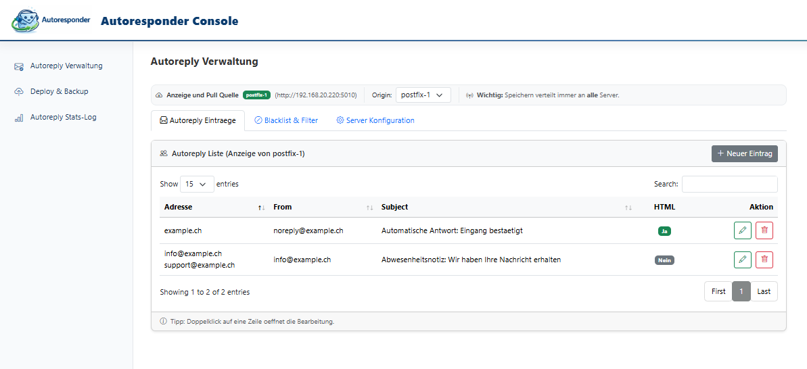
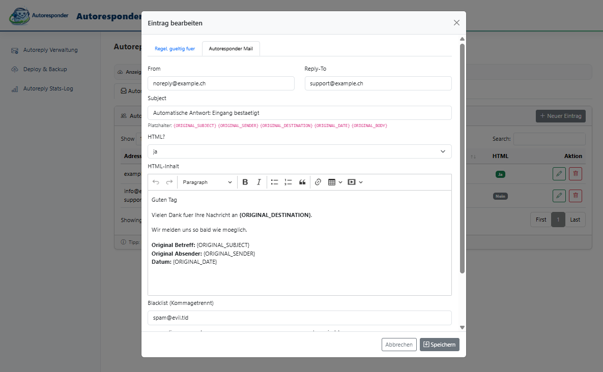
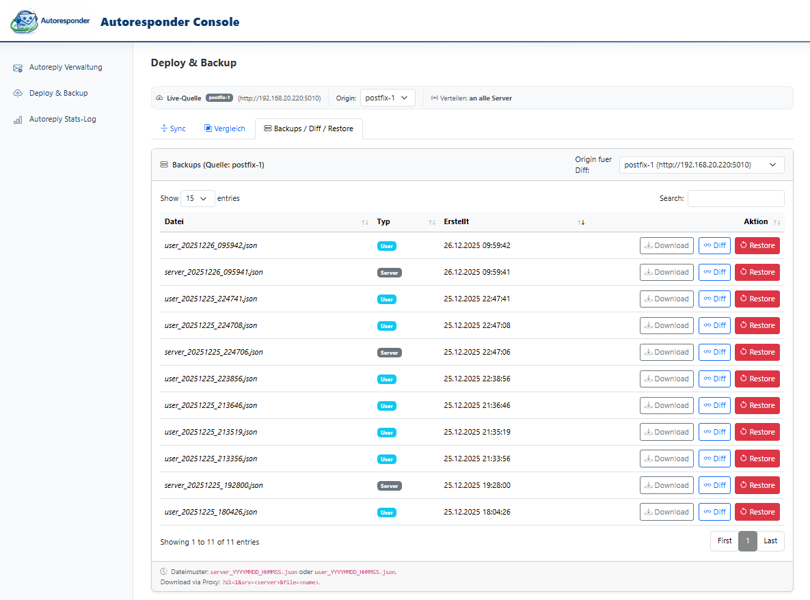
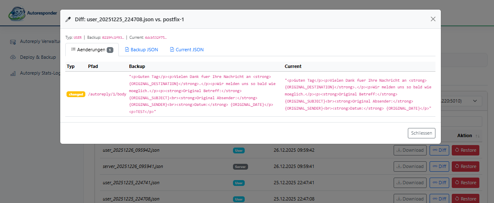

# Autoreply Plattform

Die **Autoreply Plattform** ist eine vollumfängliche Lösung für automatische Antworten in Postfix-basierten Mailinfrastrukturen.
Sie kombiniert eine robuste Mailfilter-Runtime mit einer zentralen Service- und API-Ebene sowie einer webbasierten Administrationsoberfläche.

Die Installation erfolgt **zentral über `install.sh`** und richtet alle benötigten Komponenten ein.
Die Web-Konsole ist **nicht Teil von `install.sh`** und wird separat betrieben.

---

## Inhalte dieses Repositories

- Autoreply Mailfilter (Postfix Pipe)
- Autoreply Services Agent (systemd Service mit HTTP API)
- Zentrale Konfigurations- und Backup-Mechanismen
- Installations- und Betriebslogik
- Dokumentation für Architektur, Security und API

---

## Gesamtarchitektur

Die Plattform ist strikt modular aufgebaut:

- **Postfix**  
  Übergibt E-Mails an den Autoreply Mailfilter.

- **Autoreply Mailfilter**  
  Verarbeitet eingehende E-Mails, prüft Regeln, Limits und Loop-Schutz und versendet Antworten.
  Keine Verwaltungslogik, keine API.

- **Services Agent (HTTP API)**  
  Zentrale Steuerinstanz für Konfigurationen.
  Validiert, speichert, versioniert und stellt Backups und Rollbacks bereit.

- **Autoresponder Console (WWW)**  
  Webbasierte Administrationsoberfläche.
  Greift ausschliesslich über die API zu.
  Keine direkte Mailverarbeitung.

**Datenfluss:**

GUI → Services Agent → JSON-Konfigurationen → Mailfilter → Postfix


                   ┌─────────────────┐
                   │   Deine Web-GUI  │  (Einmal Änderung)
                   └─────────┬───────┘
                             ↓
                   ┌─────────────────┐
                   │ Services Agent   │  (Validiert, speichert Backup)
                   │ (nur auf 1 Server)│
                   └─────────┬───────┘
                             ↓
        ┌──────────┬─────────┼─────────┬──────────┐
        ↓          ↓         ↓         ↓          ↓
    ┌──────┐  ┌──────┐  ┌──────┐  ┌──────┐  ┌──────┐
    │Server1│  │Server2│  │Server3│  │Server4│  │Server5│
    └──────┘  └──────┘  └──────┘  └──────┘  └──────┘
      JSON      JSON      JSON      JSON      JSON


---

## Installation (install.sh)

Die komplette Plattform wird über ein einziges Installationsskript installiert:

```bash
sudo ./install.sh
```

### Was `install.sh` installiert

- Anlegen von Service-Usern und Gruppen
- Deployment des Autoreply Mailfilters
- Installation des Services Agent
- Setzen aller benötigten Verzeichnis- und Dateiberechtigungen
- Installation und Aktivierung der systemd Services
- Initiales Anlegen von Konfigurations- und Backup-Verzeichnissen

### Was **nicht** installiert wird

- Web-/GUI-Komponenten
- Reverse Proxies
- Externe Monitoring- oder Logging-Systeme

---

## Voraussetzungen

- Linux mit systemd
- Postfix installiert und aktiv
- Perl und Python verfügbar
- Root-Zugriff für Installation
- Interner Betrieb (kein Internet-Exposure vorgesehen)

---

## Web-Konsole (Autoresponder Console)

Die Web-Konsole dient der komfortablen Administration und Visualisierung.
Sie ist **kein Bestandteil von `install.sh`**, ergänzt die Plattform aber funktional.

### Funktionen

- Verwaltung von Autoreply-Einträgen (E-Mail / Domain)
- HTML- und Text-Templates mit Platzhaltern
- Live-Quelle und Origin-Vergleich
- Backup-, Diff- und Restore-Funktion
- Verteilung auf mehrere Mailserver

### Screenshots

> Lege die Screenshots z. B. unter `docs/screenshots/` ab.

**Autoreply Verwaltung**


**Eintrag bearbeiten**


**Deploy & Backup Übersicht**


**Backup Diff Ansicht**


---

## Betriebskonzept

- Mailfluss ist unabhängig von API und GUI
- Konfigurationsänderungen erfolgen nur über den Services Agent
- Keine manuellen JSON-Edits im Produktivbetrieb
- Jede Änderung erzeugt ein Backup
- Rollbacks jederzeit möglich

---

## Sicherheit

- Interner Betrieb, keine Public-Exposition
- API-Zugriff über IP-Allowlisten
- Optionale TLS-Absicherung
- Eigene Service-User
- Keine Secrets im Code
- Nachvollziehbare Änderungen durch Backups und Diffs

Details siehe:
- `SECURITY.md`

---

## Dokumentation

- `README.md` – Gesamtübersicht und Installation
- `autoreply/README.md` – Mailfilter
- `services-agent/README.md` – Service-Betrieb
- `services-agent/README_API.md` – HTTP API

---

## Lizenz

Dieses Projekt steht unter der **MIT Lizenz**.

Siehe `LICENSE`.
